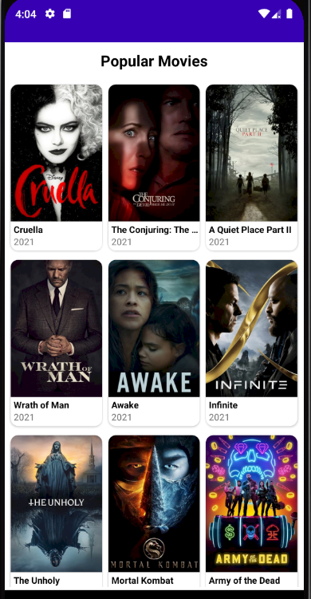
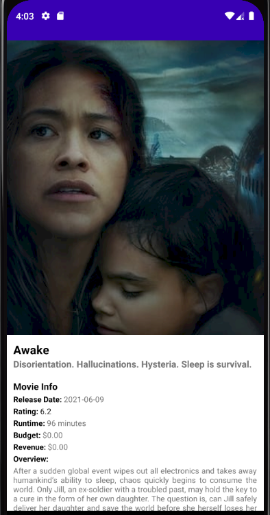

# MoviesOverviewApp
Mobile application to see the description and other features about movies.

Write an app that fetches data from the web and displays data in a list. As a minimum list
items should contain an image and a title. On tapping the item from the list it should open
a new screen displaying further details. You can use any API you prefer for fetching the
data.

##  Tech stack:

Kotlin, MVVM, Retrofit, Pagination, Rx Java
